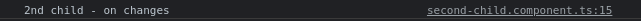
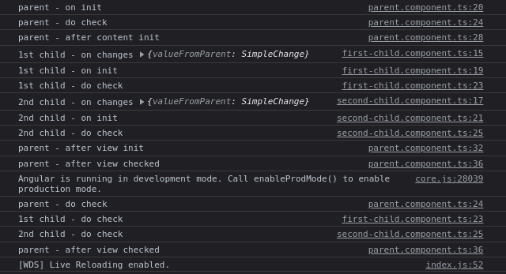

[BACK](./README.md)

# Lifecycle


Setiap component pada Angular memiliki lifecycle. Kita dapat menambahkan kode program (hooks) pada lifecycle tersebut untuk dieksekusi pada saat sebuah component melalui suatu lifecycle. Urutan dari lifecycle adalah seperti pada gambar di atas.

## OnInit

Untuk keperluan demo, kita buat 3 buah component.

```
$ ng generate component parent
$ ng generate component first-child
$ ng generate component second-child
```

Lalu ubah file-file berikut:

- **`./src/app/app.component.html`**

  ```html
  <h1>Main App</h1>
  <app-parent>
    <p>This is parent content from Main App</p>
  </app-parent>
  ```

- **`./src/app/parent/parent.component.html`**
  ```html
  <h2>Parent</h2>
  <ng-content></ng-content>
  <app-first-child></app-first-child>
  <app-second-child></app-second-child>
  ```

Pada component yang kita buat menggunakan CLI, sudah tersedia method `ngOnInit()`. Method tersebut akan dipanggil saat sebuah component diinisialisasi. Coba kita ubah file-file berikut:

- **`./src/app/parent/parent.component.ts`**

  ```ts
  ...
    ngOnInit(): void {
      console.log('parent - on init');
    }
  ...
  ```

- **`./src/app/first-child/first-child.component.ts`**

  ```ts
  ...
    ngOnInit(): void {
      console.log('1st child - on init');
    }
  ...
  ```

- **`./src/app/second-child/second-child.component.ts`**

  ```ts
  ...
    ngOnInit(): void {
      console.log('2nd child - on init');
    }
  ...
  ```

Hasil log-nya adalah seperti di bawah.


## ngAfterContentInit dan ngAfterViewInit

Seperti namanya, method `ngAfterContentInit` akan dieksekusi setelah content suatu component selesai diinisialisasi. Sedangkan `ngAfterViewInit` akan dieksekusi setelah view suatu component selesai diinisialisasi.

Untuk keperluan demo, ubah `parent.component.ts` menjadi seperti di bawah.

- **`./src/app/parent/parent.component.ts`**

  ```ts
  import { AfterContentInit, AfterViewInit, Component, OnInit } from '@angular/core';
  
  @Component({
    selector: 'app-parent',
    templateUrl: './parent.component.html',
    styleUrls: ['./parent.component.css']
  })
  export class ParentComponent implements OnInit, AfterViewInit, AfterContentInit {
  
    constructor() { }
  
    ngOnInit(): void {
      console.log('parent - on init');
    }
  
    ngAfterContentInit(): void {
      console.log('parent - after content init');
    }
  
    ngAfterViewInit(): void {
      console.log('parent - after view init');
    }
  
  }
  ```

Hasil log-nya adalah seperti di bawah.


Berdasarkan `app.component.html`, component `Parent` memiliki sebuah content yaitu sebuah tag `<p>`. Kemudian pada `parent.component.html`, kita memberikan dua buah view yaitu `<app-first-child>` dan `<app-second-child>`.

`ngAfterContentInit` akan dieksekusi saat content dari suatu component sudah selesai diinisialisasi.

`ngAfterViewInit` akan dieksekusi saat view dari suatu component sudah selesai diinisialisasi. Component `FirstChild` dan component `SecondChild` akan melalui proses inisialisasi terlebih dahulu. Maka dari itu, pada log terdapat `1st child - on init` dan `2nd child - on init`. Setelah kedua component tersebut selesai diinisialisasi, barulah method `ngAfterViewInit` pada component `Parent` dieksekusi.

## ngOnChanges

Method ini akan dieksekusi saat terjadi perubahan pada input suatu component. Untuk keperluan demo, ubah file-file berikut:

- **`./src/app/parent/parent.component.ts`**

  ```ts
  import { AfterContentInit, AfterViewInit, Component, OnChanges, OnInit } from '@angular/core';
  
  @Component({
    selector: 'app-parent',
    templateUrl: './parent.component.html',
    styleUrls: ['./parent.component.css']
  })
  export class ParentComponent implements OnInit, AfterViewInit, AfterContentInit, OnChanges {
  
    valueToFirstChild = 'initial value';
    valueToSecondChild = 'initial value';
  
    constructor() { }
  
    ngOnChanges(): void {
      console.log('parent - on changes')
    }
  
    ngOnInit(): void {
      console.log('parent - on init');
    }
  
    ngAfterContentInit(): void {
      console.log('parent - after content init');
    }
  
    ngAfterViewInit(): void {
      console.log('parent - after view init');
    }
  
    toFirstChild(): void {
      this.valueToFirstChild = Math.random().toString();
    }
  
    toSecondChild(): void {
      this.valueToSecondChild = Math.random().toString();
    }
  
  }
  ```

- **`./src/app/parent/parent.component.html`**

  ```html
  <h2>Parent</h2>
  <ng-content></ng-content>
  <button (click)="toFirstChild()">Send Random Value to First Child</button>
  <app-first-child [valueFromParent]="valueToFirstChild"></app-first-child>
  <br>
  <button (click)="toSecondChild()">Send Random Value to Second Child</button>
  <app-second-child [valueFromParent]="valueToSecondChild"></app-second-child>
  ```

  Pada bagian ini kita menambahkan sebuah input pada `FirstChild` dan `SecondChild`. Input ke component `FirstChild` didapatkan dari property `valueToFirstChild`, sedangkan input ke component `SecondChild` didapatkan dari property `valueToSecondChild`. Nilai dari `valueToFirstChild` dan `valueToSecondChild` didapatkan dari `Math.random()`, yang akan dieksekusi saat button di-click.

- **`./src/app/first-child/first-child.component.ts`**

  ```ts
  import { Component, Input, OnChanges, OnInit } from '@angular/core';
  
  @Component({
    selector: 'app-first-child',
    templateUrl: './first-child.component.html',
    styleUrls: ['./first-child.component.css']
  })
  export class FirstChildComponent implements OnInit, OnChanges {
  
    @Input() valueFromParent: string = '';
  
    constructor() { }
  
    ngOnChanges(): void {
      console.log('1st child - on changes');
    }
  
    ngOnInit(): void {
      console.log('1st child - on init');
    }
  
  }
  ```

- **`./src/app/first-child/first-child.component.html`**

  ```html
  <h3>1st Child</h3>
  <div>Value from parent:</div>
  <div>{{ valueFromParent }}</div>
  ```

- **`./src/app/second-child/second-child.component.ts`**

  ```ts
  import { Component, Input, OnChanges, OnInit } from '@angular/core';
  
  @Component({
    selector: 'app-second-child',
    templateUrl: './second-child.component.html',
    styleUrls: ['./second-child.component.css']
  })
  export class SecondChildComponent implements OnInit, OnChanges {
  
    @Input() valueFromParent: string = '';
  
    constructor() { }
  
    ngOnChanges(): void {
      console.log('2nd child - on changes');
    }
  
    ngOnInit(): void {
      console.log('2nd child - on init');
    }
  
  }
  ```

- **`./src/app/second-child/second-child.component.html`**

  ```html
  <h3>2nd Child</h3>
  <div>Value from parent:</div>
  <div>{{ valueFromParent }}</div>
  ```

Hasil log pada saat halaman di-reload adalah seperti di bawah.


Pada gambar di atas, dapat dilihat bahwa `ngOnChanges` dieksekusi sebelum `ngOnInit`. Meskipun pada component `Parent` kita menambahkan method `ngOnChanges`, method tersebut tidak dieksekusi karena component `Parent` tidak memiliki `@Input()`.

Apabila kita click salah satu button, maka akan ditampilkan log seperti di bawah.



### SimpleChanges

Method `ngOnChanges` menerima sebuah parameter dengan tipe `SimpleChanges`. `SimpleChanges` merupakan sebuah object di mana masing-masing key-nya memiliki nama yang sama dengan property `@Input()`. Masing-masing value-nya merupakan object `SimpleChange` yang memiliki key `currentValue`, `firstChange` dan `previousValue`.

- `currentValue` merupakan nilai saat ini
- `firstChange` merupakan flag yang menandakan apakah ini merupakan perubahan pertama atau tidak
- `previousValue` merupakan nilai sebelumnya

Untuk mencobanya, kita lakukan perubahan pada file-file berikut:

- **`./src/app/first-child/first-child.component.ts`**

  ```ts
  import { Component, Input, OnChanges, OnInit, SimpleChanges } from '@angular/core';
  
  @Component({
    selector: 'app-first-child',
    templateUrl: './first-child.component.html',
    styleUrls: ['./first-child.component.css']
  })
  export class FirstChildComponent implements OnInit, OnChanges {
  
    @Input() valueFromParent: string = '';
  
    constructor() { }
  
    ngOnChanges(simpleChanges: SimpleChanges): void {
      console.log('1st child - on changes', simpleChanges);
    }
  
    ngOnInit(): void {
      console.log('1st child - on init');
    }
  
  }
  ```

- **`./src/app/second-child/second-child.component.ts`**

  ```ts
  import { Component, Input, OnChanges, OnInit, SimpleChanges } from '@angular/core';
  
  @Component({
    selector: 'app-second-child',
    templateUrl: './second-child.component.html',
    styleUrls: ['./second-child.component.css']
  })
  export class SecondChildComponent implements OnInit, OnChanges {
  
    @Input() valueFromParent: string = '';
  
    constructor() { }
  
    ngOnChanges(simpleChanges: SimpleChanges): void {
      console.log('2nd child - on changes', simpleChanges);
    }
  
    ngOnInit(): void {
      console.log('2nd child - on init');
    }
  
  }
  ```

Hasil log pada saat halaman di-reload adalah seperti di bawah.


Apabila kita click salah satu button, maka akan ditampilkan log seperti di bawah.


## ngDoCheck

Method ini akan dipanggil untuk perubahan-perubahan yang terjadi. Hampir sama dengan `ngOnCheck`, namun method `ngDoCheck` dapat menangkap perubahan yang tidak tertangkap oleh `ngOnCheck`. Method `ngDoCheck` akan dieksekusi setelah `ngOnCheck`. Untuk keperluan demo, ubah file-file berikut:

- **`./src/app/app.module.ts`**

  ```ts
  import { NgModule } from '@angular/core';
  import { BrowserModule } from '@angular/platform-browser';
  import { FormsModule } from '@angular/forms';
  ...
  @NgModule({
    ...
    imports: [
      BrowserModule,
      AppRoutingModule,
      FormsModule
    ],
    providers: [],
    bootstrap: [AppComponent]
  })
  export class AppModule { }
  ```

- **`./src/app/first-child/first-child.component.ts`**

  ```ts
  import { Component, DoCheck, Input, OnChanges, OnInit, SimpleChanges } from '@angular/core';
  
  @Component({
    selector: 'app-first-child',
    templateUrl: './first-child.component.html',
    styleUrls: ['./first-child.component.css']
  })
  export class FirstChildComponent implements OnInit, OnChanges, DoCheck {
  
    @Input() valueFromParent: string = '';
  
    constructor() { }
  
    ngOnChanges(simpleChanges: SimpleChanges): void {
      console.log('1st child - on changes', simpleChanges);
    }
  
    ngOnInit(): void {
      console.log('1st child - on init');
    }
  
    ngDoCheck(): void {
      console.log('1st child - do check');
    }
  
  }
  ```

- **`./src/app/second-child/second-child.component.ts`**

  ```ts
  import { Component, DoCheck, Input, OnChanges, OnInit, SimpleChanges } from '@angular/core';
  
  @Component({
    selector: 'app-second-child',
    templateUrl: './second-child.component.html',
    styleUrls: ['./second-child.component.css']
  })
  export class SecondChildComponent implements OnInit, OnChanges, DoCheck {
  
    @Input() valueFromParent: string = '';
  
    childInput: string = 'Child input initial value';
  
    constructor() { }
  
    ngOnChanges(simpleChanges: SimpleChanges): void {
      console.log('2nd child - on changes', simpleChanges);
    }
  
    ngOnInit(): void {
      console.log('2nd child - on init');
    }
  
    ngDoCheck(): void {
      console.log('2nd child - do check');
    }
  
  }
  ```

- **`./src/app/second-child/second-child.component.html`**

  ```html
  <h3>2nd Child</h3>
  <div>Value from parent:</div>
  <div>{{ valueFromParent }}</div>
  <label for="childInput">2nd Child Input: </label>
  <input type="text" id="childInput" [(ngModel)]="childInput">
  <div>2nd Child Input Value: {{ childInput }}</div>
  ```

  Untuk keperluan demo, pada template component `SecondChild` kita menambahkan sebuah input yang kita kaitkan dengan property `childInput`. Proses ini disebut juga sebagai two-way binding pada Angular. Untuk melakukan two-way binding, kita membutuhkan `FormsModule` pada `app.module.ts`.

Lakukan hal-hal di bawah kemudian amati hasilnya pada log:

- Click salah satu tombol
- Ubah text pada text box
- Focus pada text box, kemudian hilangkan focus-nya

Contoh hasil dari log adalah seperti di bawah.


Dapat dilihat pada gambar di atas, bahwa semua method `ngDoCheck` baik di parent ataupu children akan dieksekusi. Hal ini berarti method `ngDoCheck` cukup sering dipanggil, sehingga kita harus menghindari kode-kode program yang "berat" di sini.

## ngAfterViewChecked

Seperti namanya, method `ngAfterViewChecked` akan dieksekusi setelah semua `ViewChild` pada sebuah component selesai mengeksekusi `ngDoCheck` mereka. Untuk keperluan demo, ubah `parent.component.ts` menjadi seperti di bawah.

**`./src/app/parent/parent.component.html`**

```ts
...
import { AfterContentInit, AfterViewChecked, AfterViewInit, Component, DoCheck, OnChanges, OnInit } from '@angular/core';
...
export class ParentComponent implements OnInit, AfterViewInit, AfterContentInit, OnChanges, DoCheck, AfterViewChecked {
  ...
  ngAfterViewInit(): void {
    console.log('parent - after view init');
  }

  ngAfterViewChecked(): void {
    console.log('parent - after view checked');
  }
  ...
}
```

Hasil log pada saat halaman di-reload adalah seperti di bawah.



## ngAfterContentChecked

Sama seperti `ngAfterViewChecked`. Perbedaannya adalah method `ngAfterContentChecked` akan dieksekusi setelah semua `ContentChild` pada sebuah component selesai mengeksekusi `ngDoCheck` mereka.

## ngOnDestroy

Method `ngOnDestroy` akan dieksekusi saat suatu component dihancurkan. Untuk keperluan demo, ubah file-file berikut:

- **`./src/app/parent/parent.component.ts`**

  ```ts
  import { AfterContentInit, AfterViewChecked, AfterViewInit, Component, DoCheck, OnChanges, OnInit } from '@angular/core';
  ...
  export class ParentComponent implements OnInit, AfterViewInit, AfterContentInit, OnChanges, DoCheck, AfterViewChecked {
  
    valueToFirstChild = 'initial value';
    valueToSecondChild = 'initial value';
    showChildren = true;
    ...
    toSecondChild(): void {
      this.valueToSecondChild = Math.random().toString();
    }
  
    toggleChildren(): void {
      this.showChildren = !this.showChildren;
    }
  
  }
  ```

- **`./src/app/parent/parent.component.html`**

  ```html
  <h2>Parent</h2>
  <ng-content></ng-content>
  <button (click)="toggleChildren()">Toggle Children</button>
  <br>
  <br>
  <div *ngIf="showChildren">
    <button (click)="toFirstChild()">Send Random Value to First Child</button>
    <app-first-child [valueFromParent]="valueToFirstChild"></app-first-child>
    <br>
    <button (click)="toSecondChild()">Send Random Value to Second Child</button>
    <app-second-child [valueFromParent]="valueToSecondChild"></app-second-child>  
  </div>
  ```

  Pada bagian ini kita menambahkan sebuah button yang akan mengubah nilai property `showChildren`. Apabila saat ini nilai dari `showChildren` adalah `true`, dengan menekan tombol tersebut nilai property `showChildren` akan diubah menjadi `false`. Demikian pula sebaliknya.

  Pada template component `Parent`, kita meletakkan `FirstChild` dan `SecondChild` di dalam sebuah `<div>`. Pada `<div>` tersebut kita memberikan kondisi untuk rendering, yaitu `<div>` akan di-render apabila property `showChildren` memiliki nilai `true`. Apabila property `showChildren` memiliki nilai `false`, `<div>` tersebut tidak akan dir-render.

- **`./src/app/first-child/first-child.component.html`**

  ```ts
  import { Component, DoCheck, Input, OnChanges, OnDestroy, OnInit, SimpleChanges } from '@angular/core';
  
  @Component({
    selector: 'app-first-child',
    templateUrl: './first-child.component.html',
    styleUrls: ['./first-child.component.css']
  })
  export class FirstChildComponent implements OnInit, OnChanges, DoCheck, OnDestroy {
  
    @Input() valueFromParent: string = '';
  
    constructor() { }
  
    ngOnChanges(simpleChanges: SimpleChanges): void {
      console.log('1st child - on changes', simpleChanges);
    }
  
    ngOnInit(): void {
      console.log('1st child - on init');
    }
  
    ngOnDestroy(): void {
      console.log('1st child - on destroy');
    }
  
    ngDoCheck(): void {
      console.log('1st child - do check');
    }
  
  }
  ```

- **`./src/app/second-child/second-child.component.html`**

  ```ts
  import { Component, DoCheck, Input, OnChanges, OnDestroy, OnInit, SimpleChanges } from '@angular/core';
  
  @Component({
    selector: 'app-second-child',
    templateUrl: './second-child.component.html',
    styleUrls: ['./second-child.component.css']
  })
  export class SecondChildComponent implements OnInit, OnChanges, DoCheck, OnDestroy {
  
    @Input() valueFromParent: string = '';
  
    childInput: string = 'Child input initial value';
  
    constructor() { }
  
    ngOnChanges(simpleChanges: SimpleChanges): void {
      console.log('2nd child - on changes', simpleChanges);
    }
  
    ngOnInit(): void {
      console.log('2nd child - on init');
    }
  
    ngOnDestroy(): void {
      console.log('2nd child - on destroy');
    }
  
    ngDoCheck(): void {
      console.log('2nd child - do check');
    }
  
  }
  ```

  Pada bagian ini, kita menambahkan method `ngOnDestroy` pada component `FirstChild` dan component `SecondChild`

Coba lakukan reload halaman pada web browser, kemudian tekan tombol `Toggle Children`. Hasil dari log adalah seperti di bawah.


Dari gambar di atas, dapat dilihat bahwa ketika sebuah component dihilangkan dari sebuah halaman maka method `ngOnDestroy` akan dieksekusi.

[BACK](./README.md)
